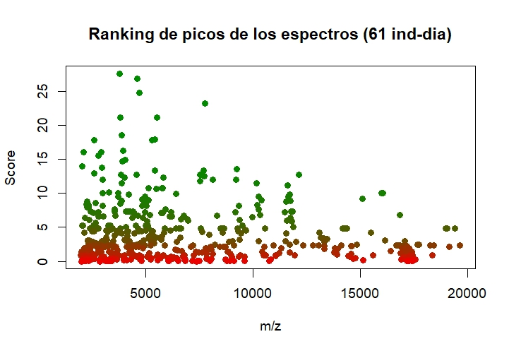
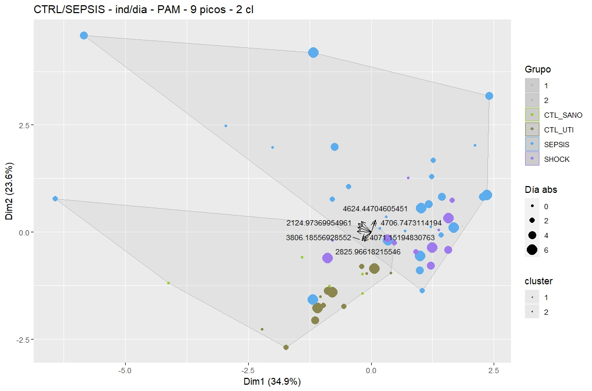
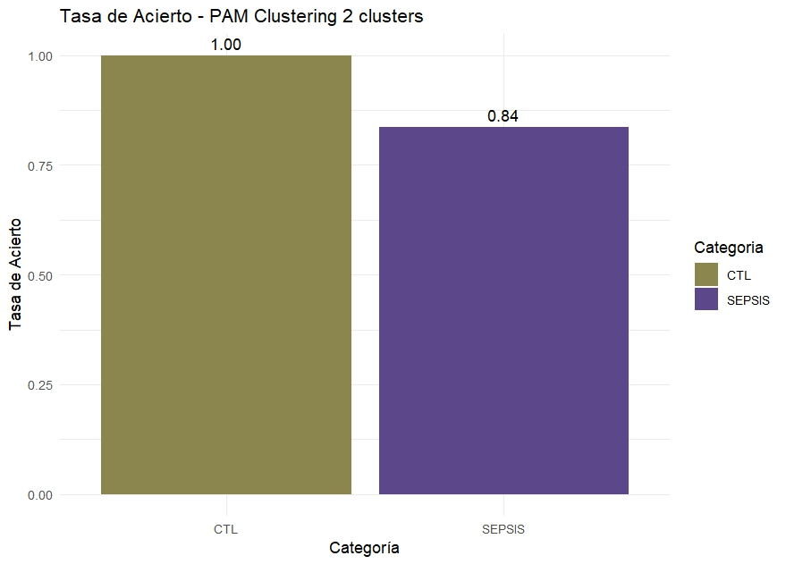
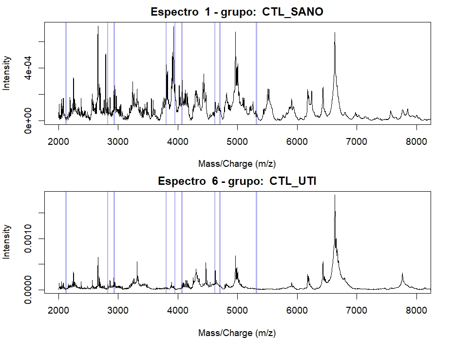
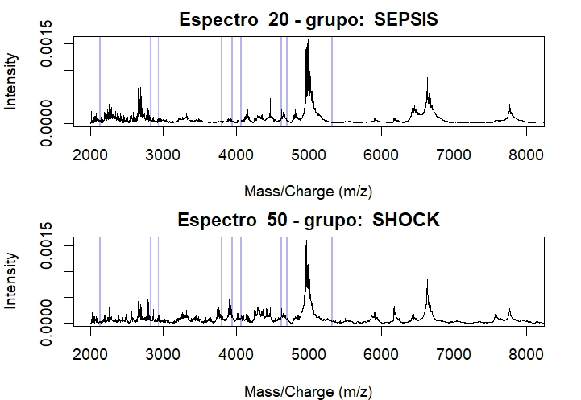
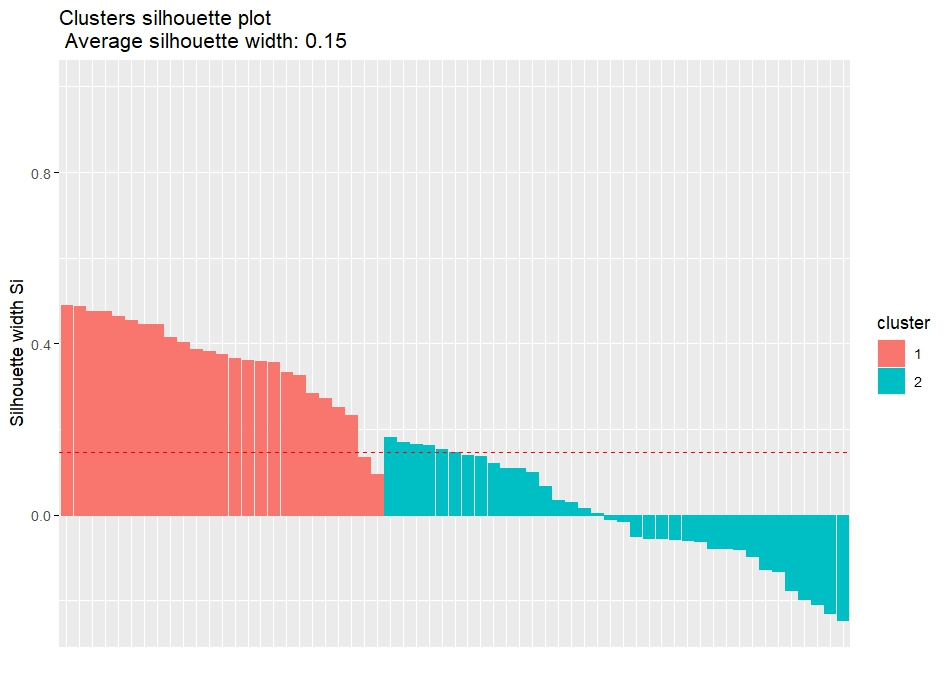

### Archivo: 2_ns_61.R

Se utilizan 61 muestras promediadas, cada una corresponde a un individuo un día determinado.

* 
 Clustering PAM - Métrica Manhattan, 2 clusters. 

  

     
   

   

     <em>Figura 1: Ranking de picos de 61 muestras</em>
   

  

     
  

  

     <em>Figura 2: Clustering</em>
  

  

     
   

   

     <em>Figura 3: Tasa de acierto de cada grupo de estudio</em>
  

  

     
   

   

     <em>Figura 4: Picos seleccionados para análisis en espectros de ejemplo</em>
  

    

     
   

   

     <em>Figura 5: Picos seleccionados para análisis en espectros de ejemplo</em>
  

  

     
   

   

     <em>Figura 5: Silhouette plot</em>
  

